 

<a href="#-about-me">About</a> •
<a href="#%EF%B8%8F-tech-stack">Tech Stack</a> •
<a href="#-featured-projects">Projects</a> •
<a href="#-github-stats">Stats</a> •
<a href="#-lets-connect">Connect</a>

###  &nbsp;&nbsp;About Me

- 🎓 B.Tech Computer Science student, currently interning at **Veersa Technologies**
- 🧠 Interested in Software Engineering, Artificial Intelligence, Full-Stack Development, Competitive Programming, and Open Source
- 🛠️ I like building things end-to-end — from data model to deployed UI — rather than staying in one layer of the stack
- 🌱 **Currently exploring:** System Design, Cloud & DevOps fundamentals, and applied Machine Learning
- 💼 **Open to:** SDE and AI-adjacent internship/collaboration opportunities
- 📍 Based in India

###  &nbsp;&nbsp;Featured Projects

> This is the only section you need to touch when you start something new — swap the card in, nothing else on the profile depends on it.

<table>
<tr>
<td width="50%" valign="top">

**🧭 Margito** &nbsp;

AI-powered career guidance platform featuring automated resume analysis, real-time job matching, and an interactive AI mock-interview simulator.

`Next.js` `TypeScript` `Node.js` `MongoDB` `Gemini/Groq API`

</td>
<td width="50%" valign="top">

**💠 SoulWare** &nbsp;

AI-powered mental wellness ecosystem providing university students with 24/7 anonymous counseling, peer support, and interactive wellness modules.

`Next.js` `Node.js` `MongoDB` `FastAPI` `Socket.IO`

</td>
</tr>
<tr>
<td width="50%" valign="top">

**🏥 Hospital Management System** &nbsp;

Full-stack healthcare platform featuring secure role-based access (Admin, Doctor, Patient), dynamic appointment management, and automated background task processing.

`Vue 3` `Flask` `SQLite` `Redis` `Celery`

</td>
<td width="50%" valign="top">

**🌐 Personal Portfolio** &nbsp;

My personal developer portfolio designed to showcase my journey as a full-stack developer, highlighting my latest projects, technical skills, and professional experience.

`HTML` `CSS` `JavaScript` `Bootstrap`

</td>
</tr>
</table>

###  &nbsp;&nbsp;GitHub Stats

  
  

  

  

### &nbsp;Contribution Snake

  <picture>
    <source media="(prefers-color-scheme: dark)" srcset="https://raw.githubusercontent.com/krishnajaindev/krishnajaindev/output/github-contribution-grid-snake-dark.svg" />
    <source media="(prefers-color-scheme: light)" srcset="https://raw.githubusercontent.com/krishnajaindev/krishnajaindev/output/github-contribution-grid-snake.svg" />
    
  </picture>

### &nbsp;Achievements

###  &nbsp;&nbsp;Let's Connect

Thanks for scrolling this far — that's rarer than a green streak. 🌱

